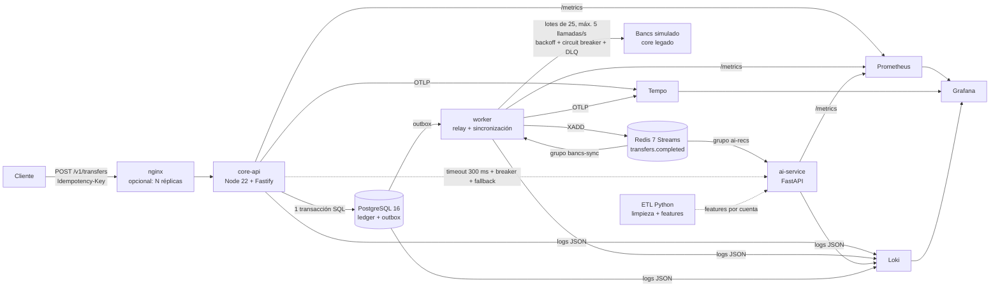
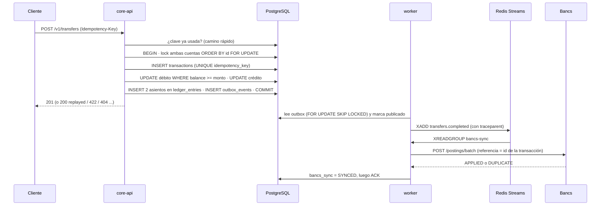
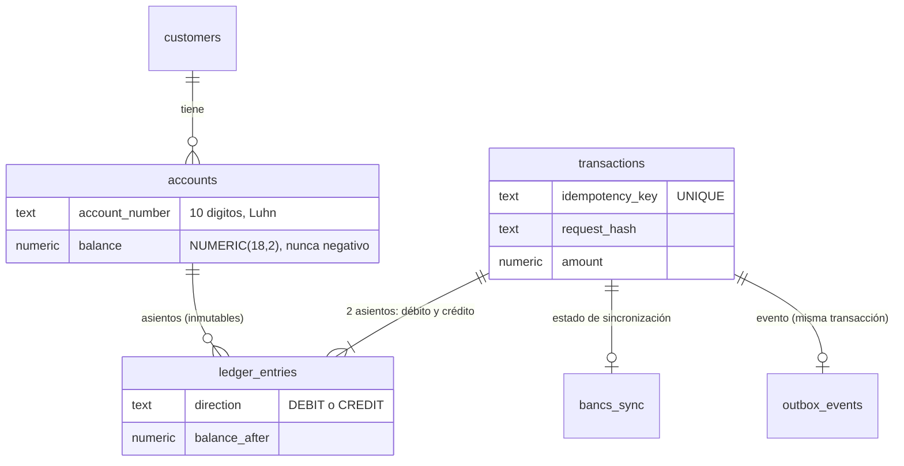

# SmartBancs App: documento técnico

Reto técnico "NextGen Engineer". Este documento recoge la arquitectura, las decisiones, la integración con Bancs, el manejo del modelo de IA,
la observabilidad y la respuesta al incidente simulado. **Regla del documento:** solo se afirman cifras que se midieron y se dice explícitamente
qué **no** se probó (sección 14).

## 0. Resumen

| Qué | Estado |
|---|---|
| API de transferencias atómica, idempotente y sin *race conditions* | Hecho y probado (concurrencia: 400 transferencias simultáneas, 50 débitos contra 1.000 de saldo, 20 peticiones idénticas) |
| Integración asíncrona con el core legado Bancs (lotes, límite de tasa, *circuit breaker*, DLQ) | Hecho y probado contra un simulador de Bancs (lento, con fallos y con caídas) |
| ETL de limpieza con reporte de calidad y features | Hecho: 2.000 filas sucias → 1.716 limpias + 284 rechazadas con motivo |
| IA desacoplada de las transferencias, con *fallback* | Hecho: con la IA lenta o apagada, las transferencias siguen dando 201 y las recomendaciones responden en < 500 ms |
| Observabilidad: métricas, logs y trazas correlacionados | Hecho: 2 dashboards, 12 alertas, una traza cruza API → SQL → outbox → Bancs |
| Incidente de deadlocks: reproducción, diagnóstico y corrección | Hecho y medido (p95 de 7 ms → 4.207 ms con 94,3 % de errores → 7 ms) |
| Rendimiento | **Medido:** ~400 tps por instancia cumpliendo el requisito (máx. ~570); 4 réplicas ≈ 1.000 tps. **10.000 TPS: no alcanzado** |
| Estados de cuenta CSV/PDF | Hecho (extra): cuadran con el ledger |
| Autenticación y autorización | **No implementadas** (MVP) |

## 1. Requisitos y dónde se cubren

| Requisito del reto | Dónde |
|---|---|
| 3.1 Microservicio con endpoint de transacción, DDL/DML, concurrencia, IaC con un comando | §2, §3; `services/core-api`, `db/`, `docker-compose.yml` |
| 3.2 Sincronización con Bancs (teórico) | §5 |
| 3.2 ETL/ELT (práctico) | §6; `etl/` |
| 3.3 Servicio de IA y consumo no bloqueante; ciclo de vida del modelo (teórico) | §7 |
| 3.4 Observabilidad (práctico y teórico) | §8; [`observabilidad.md`](observabilidad.md) |
| 3.5 Incidente (monitoreo en código y acciones inmediatas) | §9; [`runbook-incidente.md`](runbook-incidente.md) |
| 3.6 Escalamiento y post mortem | §9; [`postmortem/`](postmortem) |
| Restricciones: alta concurrencia, Bancs no soporta consultas masivas, transferencias < 2 s, IA sin bloquear | §4, §5, §7 |
| Declaración de uso de IA | [`../AI_USAGE.md`](../AI_USAGE.md) |

## 2. Arquitectura

**Principio rector:** la transferencia solo depende de PostgreSQL. Bancs, la IA y la observabilidad son *consumidores* de los eventos o llamadas de lectura
protegidas: si fallan o se vuelven lentos, la transferencia no lo nota.

### 2.1 Flujo de una transferencia

### 2.2 Modelo de datos

### 2.3 Stack y por qué (decisiones en [`adr/`](adr))

| Decisión | Razón (rendimiento, seguridad, escalabilidad) |
|---|---|
| **PostgreSQL** para el estado de dinero | Transacciones ACID y bloqueos de fila: la única forma sencilla de garantizar "ni se pierde ni se duplica dinero". `NUMERIC(18,2)`, restricciones `CHECK` y un *trigger* que hace el ledger inmutable |
| **Ledger de doble entrada** | Cada movimiento son 2 asientos que suman cero; los errores se corrigen con asientos nuevos, nunca editando. Es lo que permite los estados de cuenta y la conciliación |
| **Transactional Outbox + Redis Streams** | El evento se guarda en la *misma* transacción que la transferencia (no se pierde ni se publica un evento sin transferencia); Streams da grupos de consumidores independientes (Bancs y la IA no compiten) y reprocesamiento |
| **Node 22 + Fastify (TypeScript)** | E/S no bloqueante, esquemas de validación integrados y bajo coste por petición; el límite medido es CPU de un hilo (~570 tps por instancia), que se escala con réplicas sin estado |
| **Python (ETL e IA)** | pandas/pyarrow para datos y FastAPI para el servicio del modelo |
| **Docker Compose** | Un comando levanta todo; los perfiles (`etl`, `obs`) evitan cargar lo que no se usa |

## 3. Concurrencia y consistencia (3.1)

| Riesgo | Cómo se evita | Prueba |
|---|---|---|
| Dos débitos a la vez sobregiran la cuenta | El débito es un único `UPDATE ... WHERE balance >= monto`; `CHECK (balance >= 0)` como red de seguridad | 50 débitos simultáneos de 100 sobre 1.000 → exactamente 10 aprobados |
| Deadlock en transferencias cruzadas A→B y B→A | Ambas cuentas se bloquean en **una sola sentencia y en orden de id** (`ORDER BY id FOR UPDATE`) | Cruces simultáneos sin deadlocks; con el orden desactivado se reproduce (§9) |
| Reintentos del cliente duplican la transferencia | `Idempotency-Key` con `UNIQUE`; misma clave y mismos datos → 200 *replayed*; misma clave con datos distintos → 422 (`request_hash`) | 20 peticiones simultáneas con la misma clave → una sola transferencia |
| Se pierde el evento si cae el proceso tras el `COMMIT` | Outbox en la misma transacción; el relay usa `FOR UPDATE SKIP LOCKED` (varias réplicas sin pisarse) y entrega "al menos una vez" | Pruebas del worker con fallos inyectados |
| El dinero se descuadra | Ledger inmutable, doble entrada, saldo = último `balance_after` | Tras cada carga: dinero total conservado, cada transacción con 2 asientos que cuadran, cadena de saldos continua |
| Una transacción retiene recursos indefinidamente | `lock_timeout` 1,5 s, `statement_timeout` 3 s, timeout de conexión 2 s: falla rápido con `503` reintentable | Métricas y pruebas de incidente |

## 4. Rendimiento: 10.000 TPS y < 2 s (medido)

Detalle, método y tablas completas en [`carga-resultados.md`](carga-resultados.md). Resumen:

| Configuración (portátil, todo en la misma máquina) | Sostenido cumpliendo p95 < 2 s y errores < 1 % | Máximo medido |
|---|---|---|
| 1 instancia de core-api | 400 tps (p95 = 66 ms, 0 % errores) | ~570 tps |
| 4 réplicas + nginx | 1.000 tps (p95 203-675 ms en dos corridas, errores ≤ 0,11 %) | ~1.100 tps |

- **10.000 TPS no se alcanzaron.** El límite en una instancia es el CPU de un hilo de Node (100 %) mientras PostgreSQL usa ~1,4 de 20 núcleos.
- La velocidad no se mide sin la corrección: tras las cargas, el dinero se conserva y el ledger cuadra, incluso saturado (escalera hasta 2.000 tps con 41 % de errores).
- **Camino hacia 10.000 TPS (diseño, no probado):** ~18-20 instancias de API en hardware dedicado; PostgreSQL particionado por rango de cuenta, almacenamiento rápido y PgBouncer; neteo de movimientos hacia Bancs; varios consumidores por grupo en Redis Streams; autoescalado por CPU y por conexiones esperando.
- **Hallazgos al medir (corregidos):** conexiones nuevas en pleno pico (pool precalentado, `DB_POOL_MIN`), error de conexión devuelto como 500 (ahora 503 reintentable).

## 5. Integración con Bancs (3.2 teórico y práctico)

**Problema:** Bancs es lento, poco flexible y no soporta muchas consultas; no puede estar en el camino de cada transferencia.

**Diseño (ADR-0002):**
1. La API opera sobre el **saldo operativo local**; **nunca llama a Bancs** dentro de una transferencia.
2. El evento sale por **outbox → Redis Streams** y un consumidor lo envía a Bancs en **lotes de 25 movimientos** con un **máximo de 5 llamadas por segundo**.
3. **Reintentos con *backoff* exponencial y *jitter*** (base 200 ms) y **circuit breaker** (5 fallos seguidos → 5 s sin llamar al legado, luego una llamada de prueba). Un 429 no cuenta como fallo (el legado está vivo, pide calma).
4. **Idempotencia extremo a extremo:** la referencia hacia Bancs es el id de la transacción. Si Bancs aplica el lote pero se pierde la respuesta (504), el reintento recibe `DUPLICATE` y se da por sincronizado.
5. **Sin pérdida:** primero se escribe `bancs_sync = SYNCED` y luego se hace el ACK; si cae entre ambos, se reintenta y Bancs responde `DUPLICATE`. Lo que no se puede entregar en 15 min o es un error permanente va a la **DLQ** y queda `FAILED`.
6. **Consistencia eventual y conciliación:** `bancs_sync` y las métricas (`sync_unsynced_transactions`, `dlq_length`) muestran el retraso; la conciliación compara el neto por cuenta.

**Medido:** tras cerca de 26 minutos de cargas, el simulador de Bancs recibió 1.927 llamadas con **0 respuestas 429**, un máximo de **5 llamadas/s** y 1 en paralelo; aplicó 40.475 movimientos exactamente una vez y absorbió 2.250 reintentos como duplicados.
Con una caída simulada de Bancs la API siguió dando 201 (20 de 20), el *breaker* limitó las llamadas (7 en 15 s) y al volver se sincronizó todo sin duplicar.
Ritmo real de sincronización: 40-55 movimientos/s (por debajo del máximo teórico de 125). **Consecuencia:** tras un pico, la cola tarda minutos en vaciarse (7,5 min tras 23.000 transferencias); la API no se frena, pero el legado va detrás.
**Límite:** con 10.000 TPS sostenidos habría que netear por cuenta y ventana o cambiar a intercambio por archivos/lotes; el diseño actual absorbe *picos*, no un régimen sostenido de ese tamaño.

## 6. ETL: limpieza y estructuración de datos (3.2 práctico)

`etl/` (Python, pandas, Parquet). Entrada: extracto crudo con nulos, fechas en 7 formatos, montos con comas/símbolos, duplicados, cuentas inválidas, montos negativos y *outliers*
(generador reproducible con semilla, muestra versionada de 2.000 filas). Detalle en ADR-0003 y [`evidencias/etl-reporte-calidad.md`](evidencias/etl-reporte-calidad.md).

- **Ninguna fila desaparece en silencio:** entrantes = limpias + rechazadas con motivo (2.000 = 1.716 + 284; 77 duplicados, 44 montos no positivos, 28 cuentas inválidas...). El pipeline falla si no cuadra.
- Fechas a UTC; montos a `Decimal` con `DECIMAL(18,2)` en el Parquet (**nunca float**); cuentas con dígito verificador Luhn; *outliers* **marcados** (z-score robusto por categoría), no eliminados.
- Salida: Parquet limpio, features por cuenta (frecuencia, gasto medio, tendencia 30 vs 30 días, participación por categoría, contrapartes distintas) y reporte de calidad JSON/Markdown.
- 54 pruebas (reglas de limpieza, formatos, features, drift, pipeline completo).
- **Producción:** particionar el Parquet por fecha en almacenamiento de objetos, procesar por ventanas (Polars/Spark si el volumen lo exige), orquestar (Airflow/cron) y publicar el reporte de calidad como métrica.

## 7. IA: servicio, consumo no bloqueante y ciclo de vida del modelo (3.3)

### 7.1 Integración (práctico)
- **`ai-service` (FastAPI)** consume el stream con su **propio grupo** (`ai-recs`), independiente de Bancs: no compite ni retrasa. Genera recomendaciones por cuenta con **reglas explicables + un modelo estadístico simple** (`zscore-seg-v1`: puntaje de perfil atípico frente a la población y segmentos de gasto) sobre las features del ETL y la actividad reciente del stream.
- **core-api** lo consulta solo en `GET /v1/accounts/{n}/recommendations`, con **timeout de 300 ms, circuit breaker y *fallback***. La transferencia **no** importa ese código.
- **Medido:** con el ai-service lento (5 s) y 40 consultas en paralelo, las 40 transferencias dieron 201 (p50 17,3 ms frente a 17,0 ms de referencia) y las recomendaciones respondieron el *fallback* en < 500 ms (con el circuito abierto, ~12 ms); con el contenedor apagado igual; al volver, los eventos acumulados se procesan y core-api vuelve a servir el modelo solo.

### 7.2 Ciclo de vida del modelo en producción (teórico, con la parte medible implementada)

| Etapa | Diseño | Estado |
|---|---|---|
| **Datos** | Eventos del stream (tiempo real) + histórico limpio del ETL. Las features se calculan por cuenta (`etl/features.py`); en producción irían a un *feature store* con el mismo cálculo para entrenamiento y servicio (evita el *training-serving skew*) | ETL y features implementados |
| **Alimentación con datos nuevos** | Reentrenamiento programado (p. ej. mensual) y disparado por *drift*; el ETL reprocesa la ventana reciente y produce el conjunto de entrenamiento con su reporte de calidad | Manual hoy: el modelo se reentrena al arrancar en milisegundos con las features vigentes |
| **Entrenamiento** | Hoy: estadístico (medias y desviaciones por variable, terciles): barato, explicable, sin GPU. Si se pasa a un modelo supervisado: partición temporal (entrenar con el pasado, validar con lo más reciente), semilla fija y registro del artefacto con su versión | Estadístico implementado; supervisado: no |
| **Validación antes de desplegar** | Métricas offline sobre el periodo más reciente (precisión de las alertas de "movimiento inusual", cobertura de recomendaciones), comparación con el modelo vigente y revisión de sesgos por segmento; el candidato solo pasa si no empeora | No implementada |
| **Despliegue** | Versionado (`modelVersion` viaja en cada respuesta). **Sombra (*shadow*)**: el candidato corre en paralelo y solo se compara; luego ***canary*** (5-10 % del tráfico) y, si las métricas aguantan, 100 %. *Rollback* en un paso porque la versión anterior sigue disponible | Versionado implementado; shadow/canary: diseño |
| **Monitoreo de *data drift*** | **PSI** y **KS** entre la distribución de referencia (con la que se entrenó) y la actual, por variable, más el reporte de calidad del ETL, la latencia y el ratio de *fallback* | **Implementado y medido** (abajo) |
| **Criterios de reentrenamiento** | Alguna variable en ALERTA (PSI > 0,25) **o** 3 o más en VIGILAR (PSI 0,10-0,25 o KS significativo); además, caída de una métrica de negocio (aceptación de recomendaciones) o calendario | Regla implementada (`should_retrain`) |
| **Consumo de recursos** | Modelo ligero en CPU (entrena y sirve en ms); el servicio es sin estado y escala con réplicas; el consumo del stream es asíncrono y sin GPU; los límites se controlan con timeouts en el cliente, *circuit breaker* y *fallback*, así un pico de consultas no arrastra a las transferencias. Si el modelo creciera: servido aparte (GPU/batch), caché de resultados por cuenta, cuantización y cola con límite de concurrencia | Timeouts, breaker y fallback implementados; el resto es diseño |

**Demostración de drift medida** ([`evidencias/drift-demo.md`](evidencias/drift-demo.md), 12.000 filas y ~300 cuentas por lote):
- Otro lote del **mismo comportamiento**: PSI del monto = 0,0026, features estables → **no reentrenar**. (KS marcó *VIGILAR* en el monto con 0,0205 frente a un crítico de 0,019: con ~10.000 muestras KS detecta diferencias mínimas; por eso la señal operativa es el PSI y el criterio exige varias variables en VIGILAR.)
- Lote donde el **gasto sube un 80 %**: PSI del monto = 0,45, `avg_amount` = 0,77, `total_spent` = 0,57 → **ALERTA, reentrenar**; las variables no afectadas (`n_tx`, `n_counterparties`, `spend_trend`) siguen estables.

**Gobernanza:** recomendaciones explicables (cada una dice por qué), sin datos personales en el modelo (solo agregados por cuenta), cuentas enmascaradas en logs y respuestas; la IA aconseja y **nunca** mueve dinero ni bloquea cuentas.
**Límite honesto:** el modelo actual es estadístico y sus umbrales son heurísticos; no hay entrenamiento supervisado ni evaluación con etiquetas reales, así que **no se puede afirmar una precisión**.

## 8. Observabilidad (3.4)

Tres señales correlacionadas por `trace_id`: **métricas** (Prometheus, método RED + saturación del pool), **logs** JSON (Loki) y **trazas** (OpenTelemetry → Tempo), con 2 dashboards y 12 alertas provisionados por archivos (`docker compose --profile obs up -d`).
Cada respuesta de `POST /v1/transfers` trae `x-request-id` = `trace_id`: con él se ven los logs en core-api, relay y worker, y una traza de ~23 spans (API → cada paso SQL → outbox → sincronización con Bancs).
Diseño (qué información identifica cada problema y por qué), en [`observabilidad.md`](observabilidad.md) y ADR-0005. En producción se exportaría a Dynatrace por el mismo OTLP cambiando el endpoint (**no probado contra Dynatrace**).

## 9. Incidente crítico y gestión de incidentes (3.5 y 3.6)

**Escenario:** pico de quincena con latencia alta, timeouts de conexión y posibles deadlocks. Se reproduce con `scripts/simulate-incident.ps1`.

| Fase (120 tps cruzados sobre 6 cuentas) | p50 | p95 | Errores | Deadlocks | Timeouts del pool |
|---|---:|---:|---:|---:|---:|
| Línea base (bloqueo ordenado, pool 20) | 5 ms | 7 ms | 0 % | 0 | 0 |
| **Incidente** (bloqueo desordenado, pool 8) | **3.563 ms** | **4.207 ms** | **94,3 %** | **137** | **4.247** |
| Corrección (bloqueo ordenado) | 5 ms | 7 ms | 0 % | 0 | 0 |

- **Monitoreo en código (3.5):** cada paso SQL de la transferencia tiene histograma, contador de errores por SQLSTATE, *span* y log; en el incidente los errores aparecieron en `lock_from` y `lock_to` (**los pasos de bloqueo**, no las escrituras) y había 359-428 peticiones esperando conexión. Con el `trace_id` se llega a la traza y al log con el detalle de los procesos bloqueados.
- **Acciones inmediatas (3.5 teórico)** ([`runbook-incidente.md`](runbook-incidente.md)): revertir el cambio/flag (la que funcionó: 94,3 % → 0 %), terminar sesiones bloqueantes con `pg_terminate_backend` (en la simulación no había ninguna larga), limitar la entrada (rate limit en el balanceador), escalar réplicas de API (**no** ayuda si el problema son los bloqueos), ajustar timeouts y pool, aislar cuentas calientes, degradar lo no crítico (IA y Bancs ya no bloquean).
- **Dinero:** tras el incidente se verificó que el saldo total se conserva, el ledger cuadra y la cadena de saldos es continua (9.862 transacciones, con 137 deadlocks y 4.247 timeouts).
- **Post mortem (3.6):** estructura sin culpables en [`postmortem/plantilla.md`](postmortem/plantilla.md) (resumen, impacto, línea de tiempo, causa raíz con 5 porqués, detección y respuesta, resolución, acciones preventivas por ámbito, lecciones) y su aplicación a la simulación en [`postmortem/2026-09-19-simulacion-deadlocks.md`](postmortem/2026-09-19-simulacion-deadlocks.md).
- **Escalamiento:** L1 guardia → L2 backend + DBA (15 min sin mejora) → L3 arquitectura (30 min o riesgo de datos), con un *incident commander* que comunica cada 15-30 min.
- **Acciones preventivas:** *código:* bloqueo determinista como única implementación, prueba de concurrencia cruzada en CI, `lock_timeout`/`statement_timeout`, reintentos idempotentes; *infraestructura:* dimensionar pool y `max_connections`, PgBouncer, réplicas de API tras balanceador, límites de tasa, pruebas de carga antes de los picos (quincena), autoescalado, *canary* y *rollback* en un paso.

## 10. Seguridad

| Medida implementada | |
|---|---|
| Validación estricta de entrada (esquemas), montos como texto decimal con 2 decimales, números de cuenta con dígito verificador | Evita datos mal formados y errores de coma flotante |
| SQL siempre parametrizado; las trazas registran `$1`, nunca valores | Sin inyección SQL ni datos en trazas |
| Cuentas enmascaradas en respuestas, logs (incluidas las URL) y nombres de archivo | Mínimo dato personal en logs y telemetría |
| Idempotencia y ledger inmutable (un *trigger* rechaza `UPDATE`/`DELETE`) | Integridad y auditoría |
| CSV con neutralización de inyección de fórmulas; `Cache-Control: no-store` en estados de cuenta | Protege al usuario y a los datos financieros |
| Contenedores de core-api, worker, bancs-mock y ai-service sin privilegios (`USER node` / `appuser`); secretos por variables de entorno y `.env` fuera del repositorio | Higiene básica (el contenedor del ETL, que se ejecuta bajo demanda, corre como root: pendiente) |

**No implementado (declarado):** autenticación y autorización (cualquiera que conozca un número de cuenta puede consultarla), TLS entre servicios, gestión de secretos (KMS/Vault), límites de tasa por cliente, auditoría de accesos y cifrado en reposo. En producción son obligatorios (OAuth2/OIDC + control por titular, mTLS, WAF y rate limiting).

## 11. Estados de cuenta (extra)
`GET /v1/accounts/{n}/statements?month=YYYY-MM&format=csv|pdf`: saldo inicial, créditos, débitos, saldo final y detalle, calculados en PostgreSQL con `NUMERIC` desde el ledger en una transacción de solo lectura; los totales cuadran exactamente con el ledger y el saldo (ADR-0007).

## 11.1 Interfaz web
`web/` (HTML/CSS/JS sin compilación, nginx en el puerto 8080 con proxy a la API): cuentas y saldo, transferir con confirmación e idempotencia, movimientos, estado de cuenta y consejos de la IA. El acceso es una **demostración** (el backend no autentica) y lo dice en pantalla; lo que no tiene backend (tarjetas, créditos, inversiones) se muestra como "próxima versión".
Probada con un navegador real (33 comprobaciones, incluida una descripción con HTML que se muestra como texto y ausencia de errores de CSP).

## 11.2 Resiliencia comprobada
Con **Redis caído** la transferencia da 201, el evento queda en el outbox y al volver Redis se publica y se sincroniza con Bancs. Al **reiniciar PostgreSQL**, core-api y el worker se recuperan solos y las transferencias vuelven a dar 201.

## 12. Cómo se verificó

| Componente | Pruebas automáticas | Verificación de extremo a extremo |
|---|---|---|
| core-api | 40 (vitest): concurrencia, idempotencia, IA, métricas y deadlock real, privacidad, estados de cuenta | `verificar-paso1.ps1` (27), `verificar-estados-cuenta.ps1` (26) |
| worker + Bancs simulado | 10 | `verificar-paso2.ps1` (26) |
| ai-service | 23 (pytest, con Redis real) | `verificar-paso3.ps1` (27) |
| ETL | 54 (pytest) | ejecución en Docker y demostración de drift |
| Observabilidad | – | `verificar-paso4.ps1` (52), incluye un deadlock real y las 53 consultas de los paneles |
| Interfaz web | 33 comprobaciones con Chrome (`web/test/e2e.js`) | prueba de acceso, transferencia, errores y XSS |
| Carga e incidente | escenarios k6 con umbrales | `run-loadtest.ps1`, `find-limit.ps1`, `simulate-incident.ps1` (10) |

Todo se levanta con `docker compose up --build -d` (y `--profile obs` para la observabilidad); las instrucciones completas están en el [`README`](../README.md).

## 13. Uso de inteligencia artificial en el desarrollo
Declarado en [`AI_USAGE.md`](../AI_USAGE.md): herramientas, en qué componentes se aplicaron y qué trabajo fue propio. Todo el código se ejecutó y se probó antes de incluirse; al verificar se encontraron y corrigieron defectos reales (alertas que no se disparaban, número de cuenta en logs, error de conexión como 500, un *seed* que reiniciaba saldos).

## 14. Limitaciones y trabajo futuro (lo que NO está demostrado)
1. **10.000 TPS no se alcanzaron** (máx. medido ~1.100 con 4 réplicas en un portátil compartido). No se probó en hardware dedicado ni con PostgreSQL particionado.
2. **Bancs es un simulador**; el legado real puede comportarse distinto. El régimen sostenido de muchos miles de movimientos por segundo hacia el legado requiere neteo o intercambio por lotes (no implementado).
3. **Sin autenticación/autorización**, TLS entre servicios ni gestión de secretos.
4. **El modelo de IA es estadístico y sus umbrales son heurísticos**: no hay evaluación con etiquetas reales; shadow/canary y el reentrenamiento automático son diseño.
5. **Observabilidad:** sin Alertmanager (las alertas no notifican); solo `DeadlocksDetected` se disparó en una prueba real; Dynatrace no se probó; ai-service y Bancs no emiten trazas.
6. **Sin CI** (los tests y verificadores se ejecutan a mano); sin despliegue en Kubernetes.
7. Estados de cuenta en UTC (no en hora de Ecuador) y con un PDF sencillo.
8. Todas las cifras de rendimiento son de un **único equipo con recursos compartidos** y varían entre corridas (p. ej. 203 ms frente a 675 ms de p95 con 4 réplicas a 1.000 tps).
